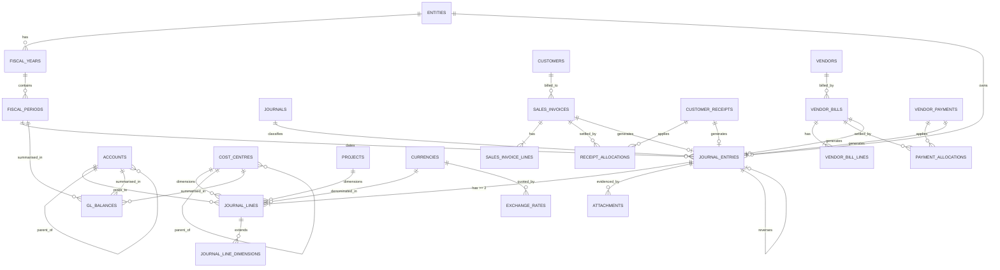

# 03 — Data Model

**Reads from:** [01](01-source-analysis.md), [02](02-architecture.md)
**Target:** PostgreSQL 16. DDL below is production-intent, not pseudocode.

> **Verified 2026-09-16.** The core ledger DDL in §3.4–3.6 plus §7.5's
> `bank_reconciliations` was executed against PostgreSQL 16.10 in a scratch
> database and created cleanly. The stated invariants were then tested and
> confirmed to reject bad data: unbalanced entry header (rejected), approver =
> creator (rejected), a line carrying both a debit and a credit (rejected), an
> approved bank reconciliation with a non-zero difference (rejected), `DELETE` of
> a posted journal line (silently blocked by the rule), `gl_balances` UPSERT
> accumulating correctly on a NULL cost centre, and `ltree` cost-centre subtree
> rollup returning the expected P&L. Subledger tables (§3.7–3.10) were not
> executed.

---

## 3.1 Chart of accounts — structure

### The central decision: natural accounts only, dimensions separate

The most consequential CoA decision is whether department/branch/project/cost
centre live **inside the account code** (segmented, e.g. `6100-01-CC30`) or
**beside it** as dimensions on the posting line.

| | Segmented code | **Dimensions (recommended)** |
|---|---|---|
| Account count | Natural accounts × cost centres × projects — thousands, growing multiplicatively | One row per natural account — ~150–400, stable |
| New cost centre | Create N new accounts, remap every report | Insert one row |
| Report by two dimensions at once | Impossible without parsing the code | `GROUP BY` |
| Maintenance | Combinatorial explosion; dead combinations accumulate | Bounded |
| Fits Doc A's "account titles should describe what is recorded" | Poorly — the title has to encode place *and* nature | Exactly |

**Recommendation: natural accounts only in the code; everything else a dimension.**
This is also what makes [05 — Cost Centres](05-cost-centres.md) a tractable feature
rather than a CoA rebuild. The rest of this document assumes it.

### Account code scheme

**Format: 4 digits, optionally extended `NNNN.NN` for sub-accounts.** Four digits
give 10 classes × 10 groups × 100 accounts — ample for A-02 scale, short enough to
be typed and remembered by the finance team.

```
   6  1  2  0
   │  │  └──┴─ account within group (00–99)
   │  └─────── group within class
   └────────── class (top-level statement classification)
```

| Range | Class | Normal balance | Statement |
|---|---|---|---|
| 1000–1999 | Assets | Debit | Balance Sheet |
| 1000–1399 | · Current assets (cash, bank, receivables, inventory, prepayments) | Debit | BS |
| 1400–1799 | · Non-current assets (land & buildings, vehicles, furniture & fittings, equipment) | Debit | BS |
| 1800–1899 | · Accumulated depreciation (contra) | **Credit** | BS |
| 1900–1999 | · Other/intangible assets | Debit | BS |
| 2000–2999 | Liabilities | Credit | BS |
| 2000–2499 | · Current liabilities (trade payables, accruals, tax payable, **customer deposits**, bank overdraft) | Credit | BS |
| 2500–2899 | · Non-current liabilities (long-term loans, mortgage) | Credit | BS |
| 2900–2999 | · Intercompany due-to | Credit | BS |
| 3000–3999 | Equity | Credit | BS / SOCE |
| 3000–3199 | · Capital / capital stock | Credit | BS |
| 3200–3399 | · Retained earnings | Credit | BS |
| 3400–3599 | · Drawings / dividends (contra-equity) | **Debit** | SOCE |
| 3600–3799 | · Reserves, FX translation reserve (CTA) | Credit | BS |
| 3900–3999 | · Current-year earnings (system-controlled) | Credit | BS |
| 4000–4999 | Revenue | Credit | P&L |
| 4000–4499 | · Sales / service revenue | Credit | P&L |
| 4500–4599 | · Returns inwards (contra-revenue) | **Debit** | P&L |
| 4600–4799 | · Discounts received, rent receivable, other income | Credit | P&L |
| 5000–5999 | Cost of sales | Debit | P&L |
| 5000–5299 | · Purchases | Debit | P&L |
| 5300–5399 | · Returns outwards (contra-COGS) | **Credit** | P&L |
| 5400–5599 | · Inventory movement / internally used items | Debit | P&L |
| 5600–5999 | · Direct labour, carriage inwards, other direct cost | Debit | P&L |
| 6000–7999 | Operating expenses | Debit | P&L |
| 6000–6499 | · Staff costs (wages, social security, benefits) | Debit | P&L |
| 6500–6999 | · Occupancy (rent, utilities, maintenance) | Debit | P&L |
| 7000–7399 | · Administrative (stationery, telephone, professional fees, insurance) | Debit | P&L |
| 7400–7599 | · Selling & distribution (advertising, carriage outwards, discounts allowed) | Debit | P&L |
| 7600–7799 | · Depreciation & amortisation expense | Debit | P&L |
| 7800–7899 | · Irrecoverable debts & impairment | Debit | P&L |
| 8000–8999 | Other income / expense, finance, FX | Either | P&L |
| 8000–8399 | · Finance costs (interest) | Debit | P&L |
| 8400–8699 | · FX gain/loss (realised & unrealised) | Either | P&L |
| 8700–8899 | · Gain/loss on asset disposal | Either | P&L |
| 9000–9499 | Tax | Debit | P&L |
| 9500–9899 | Clearing & suspense (**must be zero at close**) | Either | BS |
| 9900–9999 | Statistical / memo (non-financial drivers; never in TB) | n/a | — |

Rules governing the scheme:
- **Only leaf accounts are postable.** Parents exist for rollup and are flagged
  `is_postable = false`.
- Ranges 9500–9899 are reconciliation-critical: the period-close gate in
  [07 §7.5](07-reporting-controls.md) refuses to lock a period while any suspense
  or clearing account is non-zero. This is a direct answer to ABX irregularity #3.
- **Reserve gaps deliberately.** Numbering `6010, 6020, 6030` rather than
  `6001, 6002, 6003` leaves room to insert without renumbering, which is the
  usual cause of a CoA rebuild three years in.
- Contra accounts (1800s, 3400s, 4500s, 5300s) carry a `normal_balance` opposing
  their class and a `contra_of_account_id` — required by FR-014 and Doc A's
  treatment of Accumulated Depreciation.

### Statutory code mapping (A-04)

Iraqi entities may be required to report under the **Unified Accounting System
(النظام المحاسبي الموحد)**, whose account numbering differs from the scheme above.
Rather than contorting the operational CoA to a statutory layout — which degrades
day-to-day usability — every account carries an optional `statutory_code` and
statutory reports map through it. This keeps one set of books serving two
presentations.

> ⚠ I have not verified the current Iraqi statutory requirement or its code list.
> Confirm the applicable regime and obtain the official code list from Al-Idan's
> tax adviser before Phase 1 CoA freeze (assumption A-04).

---

## 3.2 Dimensions — the model

Five dimensions are proposed. **Cost centre is first-class** (a column on the
posting line); the rationale, alternatives and trade-offs are argued in full in
[05 §5.2](05-cost-centres.md).

| Dimension | Cardinality | Storage | Applies to |
|---|---|---|---|
| **Cost centre** | 20–200 | Column on `journal_lines` | P&L mandatory, BS optional |
| **Project / job** | 10–1000s | Column on `journal_lines` | Where used |
| **Department** | 5–30 | Attribute *of* the cost centre (not a separate posting dimension) | Derived |
| **Branch / location** | 2–20 | Attribute *of* the cost centre | Derived |
| Free dimensions (fund, campaign, contract…) | rare | Generic `journal_line_dimensions` side table | Optional |

The hybrid is deliberate: **hot dimensions as columns, cold dimensions as EAV.**
Two nullable `bigint` columns cost 16 bytes per line and make cost-centre
reporting a plain indexed aggregate; an EAV-only design turns every management
report into a join-and-pivot that degrades as the ledger grows. Conversely,
promoting *every* possible dimension to a column produces a wide, sparse table and
a schema migration for each new analysis axis.

Department and branch are modelled as **attributes of the cost centre** rather
than independent dimensions because in practice a cost centre belongs to exactly
one department and one branch. Making them separate posting dimensions invites
contradictory combinations (cost centre "Baghdad Sales" tagged to branch "Basra")
that no validation can sensibly resolve.

---

## 3.3 ERD — core ledger



---

## 3.4 Core ledger DDL

> Tables are presented in logical reading order, not creation order — several
> forward-reference each other (`entities` → `currencies`, `journal_lines` →
> `cost_centres`). In Laravel migrations, create the referenced tables first or
> add the foreign keys in a follow-up migration.

```sql
-- ─────────────────────────── Organisation & calendar ───────────────────────────
CREATE TABLE entities (
    id                      bigserial PRIMARY KEY,
    parent_id               bigint REFERENCES entities(id),
    code                    varchar(20)  NOT NULL UNIQUE,
    name                    varchar(200) NOT NULL,
    name_ar                 varchar(200),
    legal_name              varchar(200),
    tax_registration_no     varchar(50),
    functional_currency     char(3) NOT NULL REFERENCES currencies(code),
    is_consolidation_node   boolean NOT NULL DEFAULT false,  -- true = no direct posting
    retained_earnings_account_id bigint REFERENCES accounts(id),
    current_earnings_account_id  bigint REFERENCES accounts(id),
    is_active               boolean NOT NULL DEFAULT true,
    created_at timestamptz NOT NULL DEFAULT now(),
    updated_at timestamptz NOT NULL DEFAULT now()
);

CREATE TABLE fiscal_years (
    id          bigserial PRIMARY KEY,
    entity_id   bigint NOT NULL REFERENCES entities(id),
    code        varchar(10) NOT NULL,           -- 'FY2027'
    starts_on   date NOT NULL,
    ends_on     date NOT NULL,
    status      varchar(20) NOT NULL DEFAULT 'open',  -- open | closed
    UNIQUE (entity_id, code),
    CHECK (ends_on > starts_on)
);

CREATE TABLE fiscal_periods (
    id              bigserial PRIMARY KEY,
    fiscal_year_id  bigint NOT NULL REFERENCES fiscal_years(id),
    entity_id       bigint NOT NULL REFERENCES entities(id),
    period_no       smallint NOT NULL,          -- 1..12, 13 = adjustment period
    name            varchar(40) NOT NULL,
    starts_on       date NOT NULL,
    ends_on         date NOT NULL,
    status          varchar(20) NOT NULL DEFAULT 'open',
        -- open | soft_closed (subledgers locked, GL open) | closed | permanently_closed
    closed_at       timestamptz,
    closed_by       bigint REFERENCES users(id),
    UNIQUE (fiscal_year_id, period_no),
    CHECK (ends_on >= starts_on)
);

-- ──────────────────────────── Chart of accounts ────────────────────────────────
CREATE TABLE accounts (
    id                  bigserial PRIMARY KEY,
    parent_id           bigint REFERENCES accounts(id),
    code                varchar(20) NOT NULL UNIQUE,
    name                varchar(200) NOT NULL,
    name_ar             varchar(200),
    account_class       varchar(20) NOT NULL,
        -- asset | liability | equity | revenue | cost_of_sales | expense
        -- | other_income | other_expense | tax | clearing | statistical
    account_subtype     varchar(40),   -- current_asset | fixed_asset | accum_depreciation …
    normal_balance      char(1) NOT NULL CHECK (normal_balance IN ('D','C')),
    statement           varchar(10) NOT NULL CHECK (statement IN ('BS','PL','SOCE','NONE')),
    cash_flow_class     varchar(20),   -- operating | investing | financing | none
    contra_of_account_id bigint REFERENCES accounts(id),
    is_postable         boolean NOT NULL DEFAULT true,   -- leaf accounts only
    is_control_account  boolean NOT NULL DEFAULT false,  -- AR/AP control: subledger-only
    control_subledger   varchar(20),   -- receivables | payables | inventory | fixed_assets
    requires_cost_centre boolean NOT NULL DEFAULT false, -- see 05
    requires_project     boolean NOT NULL DEFAULT false,
    allow_manual_entry   boolean NOT NULL DEFAULT true,
    currency_code       char(3) REFERENCES currencies(code),  -- NULL = multi-currency
    is_reconcilable     boolean NOT NULL DEFAULT false,       -- bank/clearing
    statutory_code      varchar(30),                          -- Iraqi UAS mapping, A-04
    is_active           boolean NOT NULL DEFAULT true,
    created_at timestamptz NOT NULL DEFAULT now(),
    updated_at timestamptz NOT NULL DEFAULT now(),
    CHECK (NOT (is_control_account AND allow_manual_entry))   -- FR-010
);

CREATE TABLE entity_account_settings (   -- which accounts a given entity may use
    entity_id  bigint NOT NULL REFERENCES entities(id),
    account_id bigint NOT NULL REFERENCES accounts(id),
    is_enabled boolean NOT NULL DEFAULT true,
    PRIMARY KEY (entity_id, account_id)
);

-- ───────────────────────────── Currency & rates ────────────────────────────────
CREATE TABLE currencies (
    code            char(3) PRIMARY KEY,        -- IQD, USD, EUR
    name            varchar(60) NOT NULL,
    symbol          varchar(10),
    decimal_places  smallint NOT NULL DEFAULT 2, -- IQD = 0 in practice; see 04 §4.7
    is_active       boolean NOT NULL DEFAULT true
);

CREATE TABLE exchange_rates (
    id              bigserial PRIMARY KEY,
    from_currency   char(3) NOT NULL REFERENCES currencies(code),
    to_currency     char(3) NOT NULL REFERENCES currencies(code),
    rate_date       date NOT NULL,
    rate_type       varchar(20) NOT NULL DEFAULT 'spot',  -- spot | average | closing | budget
    rate            numeric(20,10) NOT NULL CHECK (rate > 0),
    source          varchar(60),        -- 'CBI' | 'manual' | 'api:xyz'
    created_by      bigint REFERENCES users(id),
    created_at      timestamptz NOT NULL DEFAULT now(),
    UNIQUE (from_currency, to_currency, rate_date, rate_type)
);

-- ──────────────────────── Journals (books of prime entry) ──────────────────────
CREATE TABLE journals (          -- FR-005, seeded with Doc B's six books
    id                  bigserial PRIMARY KEY,
    code                varchar(10) NOT NULL UNIQUE,  -- SDB PDB RIB ROB CB PCB GJ
    name                varchar(100) NOT NULL,
    name_ar             varchar(100),
    journal_type        varchar(30) NOT NULL,
        -- sales | purchases | returns_in | returns_out | cash | petty_cash
        -- | general | payroll | fixed_assets | inventory | closing | allocation | opening
    default_debit_account_id  bigint REFERENCES accounts(id),
    default_credit_account_id bigint REFERENCES accounts(id),
    allows_manual_entry boolean NOT NULL DEFAULT false, -- only GJ true by default
    sequence_prefix     varchar(10) NOT NULL,
    is_active           boolean NOT NULL DEFAULT true
);

-- ───────────────────────────── Journal entries ─────────────────────────────────
CREATE TABLE journal_entries (
    id                  bigserial PRIMARY KEY,
    entity_id           bigint NOT NULL REFERENCES entities(id),
    journal_id          bigint NOT NULL REFERENCES journals(id),
    fiscal_period_id    bigint NOT NULL REFERENCES fiscal_periods(id),
    entry_no            varchar(30) NOT NULL,     -- gapless per journal per year
    entry_date          date NOT NULL,
    posting_date        date NOT NULL,            -- may differ from entry_date
    description         text NOT NULL,            -- Doc A: explanation is mandatory
    description_ar      text,
    currency_code       char(3) NOT NULL REFERENCES currencies(code),
    exchange_rate       numeric(20,10) NOT NULL DEFAULT 1,

    source_type         varchar(50)  NOT NULL,    -- sales_invoice | vendor_bill | manual …
    source_id           bigint,
    source_document_no  varchar(60),              -- FR-007, Doc B serial reference
    source_document_date date,

    status              varchar(20) NOT NULL DEFAULT 'draft',
        -- draft | pending_approval | approved | posted | reversed
    is_adjusting        boolean NOT NULL DEFAULT false,   -- FR-012/013
    is_closing          boolean NOT NULL DEFAULT false,
    is_opening          boolean NOT NULL DEFAULT false,
    reverses_entry_id   bigint REFERENCES journal_entries(id),
    reversed_by_entry_id bigint REFERENCES journal_entries(id),
    reversal_reason     text,
    auto_reverse_on     date,                     -- accruals reversing next period
    intercompany_link_id uuid,                    -- pairs cross-entity entries

    total_debit         numeric(20,4) NOT NULL DEFAULT 0,
    total_credit        numeric(20,4) NOT NULL DEFAULT 0,

    created_by          bigint NOT NULL REFERENCES users(id),
    approved_by         bigint REFERENCES users(id),
    approved_at         timestamptz,
    posted_by           bigint REFERENCES users(id),
    posted_at           timestamptz,
    entry_hash          char(64),                 -- tamper-evidence chain, 02 §2.6
    prev_entry_hash     char(64),
    created_at timestamptz NOT NULL DEFAULT now(),
    updated_at timestamptz NOT NULL DEFAULT now(),

    UNIQUE (entity_id, journal_id, entry_no),
    CHECK (total_debit = total_credit),                       -- FR-002 / P12
    CHECK (status <> 'posted' OR posted_at IS NOT NULL),
    CHECK (created_by <> approved_by OR approved_by IS NULL)  -- SoD, 02 §2.6
);

CREATE TABLE journal_lines (
    id                  bigserial,
    journal_entry_id    bigint NOT NULL REFERENCES journal_entries(id) ON DELETE RESTRICT,
    entity_id           bigint NOT NULL REFERENCES entities(id),      -- denormalised
    fiscal_period_id    bigint NOT NULL REFERENCES fiscal_periods(id),-- denormalised
    entry_date          date NOT NULL,                                -- denormalised
    line_no             smallint NOT NULL,
    account_id          bigint NOT NULL REFERENCES accounts(id),

    -- dimensions (3.2)
    cost_centre_id      bigint REFERENCES cost_centres(id),
    project_id          bigint REFERENCES projects(id),

    -- amounts: transaction currency and entity functional currency
    currency_code       char(3) NOT NULL REFERENCES currencies(code),
    exchange_rate       numeric(20,10) NOT NULL DEFAULT 1,
    debit_amount        numeric(20,4) NOT NULL DEFAULT 0 CHECK (debit_amount  >= 0),
    credit_amount       numeric(20,4) NOT NULL DEFAULT 0 CHECK (credit_amount >= 0),
    functional_debit    numeric(20,4) NOT NULL DEFAULT 0,
    functional_credit   numeric(20,4) NOT NULL DEFAULT 0,

    description         text,
    -- subledger linkage
    partner_type        varchar(20),   -- customer | vendor | employee | intercompany
    partner_id          bigint,
    tax_code_id         bigint REFERENCES tax_codes(id),
    tax_base_amount     numeric(20,4),
    quantity            numeric(20,4), -- statistical / driver quantity
    uom                 varchar(20),

    reconciliation_id   bigint,        -- bank & open-item matching
    posted_at           timestamptz,

    PRIMARY KEY (id, entry_date),      -- partition-ready, 02 §2.5
    CHECK (debit_amount = 0 OR credit_amount = 0),  -- never both on one line
    CHECK (debit_amount > 0 OR credit_amount > 0)   -- never a zero line
);
```

Two constraints above carry real weight. `CHECK (debit_amount = 0 OR credit_amount = 0)`
forbids the "net line" that quietly appears in hand-built systems and destroys
the debit/credit analysis Doc A's trial balance depends on. `CHECK (total_debit =
total_credit)` on the header makes FR-002 a database invariant rather than a hope —
combined with a trigger that recomputes the totals from the lines on commit, an
unbalanced entry becomes physically unrepresentable.

---

## 3.5 Dimensions DDL

```sql
CREATE TABLE cost_centres (
    id                  bigserial PRIMARY KEY,
    entity_id           bigint REFERENCES entities(id),   -- NULL = shared across group
    parent_id           bigint REFERENCES cost_centres(id),
    code                varchar(20) NOT NULL,
    name                varchar(150) NOT NULL,
    name_ar             varchar(150),
    cost_centre_type    varchar(20) NOT NULL,
        -- operating (revenue-earning) | support (allocated out) | project | admin | statistical
    department          varchar(80),     -- attribute, not a posting dimension (3.2)
    branch              varchar(80),
    manager_user_id     bigint REFERENCES users(id),
    path                ltree,           -- materialised hierarchy path for fast rollup
    depth               smallint NOT NULL DEFAULT 0,
    is_postable         boolean NOT NULL DEFAULT true,   -- leaves only
    allows_revenue      boolean NOT NULL DEFAULT true,
    effective_from      date,
    effective_to        date,            -- closed centres stay for history
    is_active           boolean NOT NULL DEFAULT true,
    UNIQUE (entity_id, code)
);
CREATE INDEX cc_path_gist ON cost_centres USING gist (path);

CREATE TABLE projects (
    id              bigserial PRIMARY KEY,
    entity_id       bigint REFERENCES entities(id),
    code            varchar(30) NOT NULL,
    name            varchar(200) NOT NULL,
    customer_id     bigint REFERENCES customers(id),
    cost_centre_id  bigint REFERENCES cost_centres(id),  -- default CC for the project
    starts_on       date,
    ends_on         date,
    status          varchar(20) NOT NULL DEFAULT 'active',
    UNIQUE (entity_id, code)
);

-- generic side table for rare/optional dimensions (3.2)
CREATE TABLE dimensions (
    id          bigserial PRIMARY KEY,
    code        varchar(30) NOT NULL UNIQUE,
    name        varchar(100) NOT NULL,
    is_active   boolean NOT NULL DEFAULT true
);
CREATE TABLE dimension_members (
    id              bigserial PRIMARY KEY,
    dimension_id    bigint NOT NULL REFERENCES dimensions(id),
    code            varchar(40) NOT NULL,
    name            varchar(150) NOT NULL,
    UNIQUE (dimension_id, code)
);
CREATE TABLE journal_line_dimensions (
    journal_line_id     bigint NOT NULL,
    entry_date          date   NOT NULL,
    dimension_id        bigint NOT NULL REFERENCES dimensions(id),
    dimension_member_id bigint NOT NULL REFERENCES dimension_members(id),
    PRIMARY KEY (journal_line_id, entry_date, dimension_id),
    FOREIGN KEY (journal_line_id, entry_date) REFERENCES journal_lines(id, entry_date)
);
```

`ltree` for the cost-centre hierarchy is a deliberate PostgreSQL-specific choice:
"all descendants of `CC.SALES`" becomes `WHERE path <@ 'CC.SALES'` against a GiST
index, instead of a recursive CTE per report. Cost-centre rollup is the single
most frequent query in management reporting, so it is worth optimising directly.

---

## 3.6 Balance store

```sql
CREATE TABLE gl_balances (
    id                  bigserial PRIMARY KEY,
    entity_id           bigint NOT NULL REFERENCES entities(id),
    fiscal_period_id    bigint NOT NULL REFERENCES fiscal_periods(id),
    account_id          bigint NOT NULL REFERENCES accounts(id),
    cost_centre_id      bigint REFERENCES cost_centres(id),
    project_id          bigint REFERENCES projects(id),
    currency_code       char(3) NOT NULL,
    opening_debit       numeric(20,4) NOT NULL DEFAULT 0,
    opening_credit      numeric(20,4) NOT NULL DEFAULT 0,
    period_debit        numeric(20,4) NOT NULL DEFAULT 0,
    period_credit       numeric(20,4) NOT NULL DEFAULT 0,
    functional_period_debit  numeric(20,4) NOT NULL DEFAULT 0,
    functional_period_credit numeric(20,4) NOT NULL DEFAULT 0,
    updated_at          timestamptz NOT NULL DEFAULT now(),
    UNIQUE NULLS NOT DISTINCT
        (entity_id, fiscal_period_id, account_id, cost_centre_id, project_id, currency_code)
);
```

`NULLS NOT DISTINCT` (PostgreSQL 15+) is essential here, not cosmetic. Under the
default `NULLS DISTINCT`, every posting with no cost centre would insert a *new*
row rather than accumulating into the existing one, because `NULL <> NULL` — the
balance table would silently grow one row per posting and the UPSERT would never
match. This is the kind of defect that surfaces months later as a slow trial
balance.

Maintained by an `UPSERT … ON CONFLICT DO UPDATE SET period_debit = gl_balances.period_debit + EXCLUDED.period_debit`
executed **inside the posting transaction**. Because the unique key includes the
dimensions, a cost-centre P&L is as cheap as a company P&L — the property that
makes [05](05-cost-centres.md) viable at scale. A nightly verification job
recomputes from `journal_lines` and raises an alert on any difference.

---

## 3.7 AR / AP (FR-010, FR-027)

```sql
CREATE TABLE customers (
    id bigserial PRIMARY KEY,
    entity_id bigint NOT NULL REFERENCES entities(id),
    code varchar(30) NOT NULL, name varchar(200) NOT NULL, name_ar varchar(200),
    tax_registration_no varchar(50),
    receivable_account_id bigint NOT NULL REFERENCES accounts(id),  -- control account
    deposit_account_id    bigint REFERENCES accounts(id),           -- FR-027, ABX #1
    default_cost_centre_id bigint REFERENCES cost_centres(id),
    currency_code char(3) REFERENCES currencies(code),
    payment_terms_days smallint NOT NULL DEFAULT 30,
    credit_limit numeric(20,4),
    is_active boolean NOT NULL DEFAULT true,
    UNIQUE (entity_id, code)
);

CREATE TABLE sales_invoices (
    id bigserial PRIMARY KEY,
    entity_id bigint NOT NULL REFERENCES entities(id),
    customer_id bigint NOT NULL REFERENCES customers(id),
    invoice_no varchar(30) NOT NULL,      -- gapless, FR-028
    invoice_date date NOT NULL, due_date date NOT NULL,
    currency_code char(3) NOT NULL, exchange_rate numeric(20,10) NOT NULL DEFAULT 1,
    subtotal numeric(20,4) NOT NULL, tax_total numeric(20,4) NOT NULL DEFAULT 0,
    total numeric(20,4) NOT NULL,
    amount_settled numeric(20,4) NOT NULL DEFAULT 0,
    status varchar(20) NOT NULL DEFAULT 'draft',
        -- draft | pending_approval | issued | partially_settled | settled | cancelled
    journal_entry_id bigint REFERENCES journal_entries(id),
    cost_centre_id bigint REFERENCES cost_centres(id),
    project_id bigint REFERENCES projects(id),
    created_by bigint NOT NULL REFERENCES users(id),
    UNIQUE (entity_id, invoice_no)
);

CREATE TABLE sales_invoice_lines (
    id bigserial PRIMARY KEY,
    sales_invoice_id bigint NOT NULL REFERENCES sales_invoices(id) ON DELETE CASCADE,
    line_no smallint NOT NULL,
    item_id bigint REFERENCES items(id),
    description text NOT NULL,
    quantity numeric(20,4) NOT NULL DEFAULT 1,
    unit_price numeric(20,4) NOT NULL,
    discount_amount numeric(20,4) NOT NULL DEFAULT 0,
    revenue_account_id bigint NOT NULL REFERENCES accounts(id),
    cost_centre_id bigint REFERENCES cost_centres(id),   -- line-level override
    project_id bigint REFERENCES projects(id),
    tax_code_id bigint REFERENCES tax_codes(id),
    tax_amount numeric(20,4) NOT NULL DEFAULT 0,
    line_total numeric(20,4) NOT NULL
);

CREATE TABLE customer_receipts (          -- FR-027: posts on receipt, not on delivery
    id bigserial PRIMARY KEY,
    entity_id bigint NOT NULL REFERENCES entities(id),
    customer_id bigint NOT NULL REFERENCES customers(id),
    receipt_no varchar(30) NOT NULL,
    receipt_date date NOT NULL,
    payment_method varchar(20) NOT NULL,   -- cash | cheque | transfer | card
    bank_account_id bigint REFERENCES bank_accounts(id),
    cheque_no varchar(40), cheque_date date,
    currency_code char(3) NOT NULL, exchange_rate numeric(20,10) NOT NULL DEFAULT 1,
    amount numeric(20,4) NOT NULL CHECK (amount > 0),
    amount_allocated numeric(20,4) NOT NULL DEFAULT 0,
    is_advance boolean NOT NULL DEFAULT false,   -- unapplied = customer deposit liability
    journal_entry_id bigint REFERENCES journal_entries(id),
    UNIQUE (entity_id, receipt_no)
);

CREATE TABLE receipt_allocations (
    id bigserial PRIMARY KEY,
    customer_receipt_id bigint NOT NULL REFERENCES customer_receipts(id),
    sales_invoice_id bigint NOT NULL REFERENCES sales_invoices(id),
    amount numeric(20,4) NOT NULL CHECK (amount > 0),
    allocated_at timestamptz NOT NULL DEFAULT now(),
    allocated_by bigint NOT NULL REFERENCES users(id),
    journal_entry_id bigint REFERENCES journal_entries(id)  -- deposit → AR reclass
);
```

`vendors`, `vendor_bills`, `vendor_bill_lines`, `vendor_payments`,
`payment_allocations` mirror the above; `vendor_bills` adds `vendor_invoice_no`
(the supplier's own number, `UNIQUE (vendor_id, vendor_invoice_no)` — duplicate
invoice prevention) and `purchase_order_id` / `goods_receipt_id` for three-way
match (ABX #2).

---

## 3.8 Fixed assets

```sql
CREATE TABLE asset_categories (
    id bigserial PRIMARY KEY, code varchar(20) NOT NULL UNIQUE, name varchar(150) NOT NULL,
    asset_account_id              bigint NOT NULL REFERENCES accounts(id),  -- 1400s
    accum_depreciation_account_id bigint NOT NULL REFERENCES accounts(id),  -- 1800s contra
    depreciation_expense_account_id bigint NOT NULL REFERENCES accounts(id),-- 7600s
    disposal_gain_account_id bigint REFERENCES accounts(id),
    disposal_loss_account_id bigint REFERENCES accounts(id),
    default_method varchar(30) NOT NULL DEFAULT 'straight_line',
        -- straight_line | reducing_balance | units_of_production
    default_useful_life_months smallint,
    default_residual_pct numeric(5,2) NOT NULL DEFAULT 0,
    capitalisation_threshold numeric(20,4)   -- below this → expense (Doc A, materiality P9)
);

CREATE TABLE fixed_assets (
    id bigserial PRIMARY KEY,
    entity_id bigint NOT NULL REFERENCES entities(id),
    asset_category_id bigint NOT NULL REFERENCES asset_categories(id),
    asset_no varchar(30) NOT NULL, name varchar(200) NOT NULL,
    parent_asset_id bigint REFERENCES fixed_assets(id),  -- componentisation
    cost_centre_id bigint REFERENCES cost_centres(id),   -- where depreciation is charged
    acquisition_date date NOT NULL,
    in_service_date date,
    acquisition_cost numeric(20,4) NOT NULL,
    residual_value numeric(20,4) NOT NULL DEFAULT 0,
    useful_life_months smallint NOT NULL,
    depreciation_method varchar(30) NOT NULL,
    accumulated_depreciation numeric(20,4) NOT NULL DEFAULT 0,
    status varchar(20) NOT NULL DEFAULT 'active',  -- active|fully_depreciated|disposed|impaired
    disposal_date date, disposal_proceeds numeric(20,4),
    source_bill_id bigint REFERENCES vendor_bills(id),
    UNIQUE (entity_id, asset_no)
);

CREATE TABLE depreciation_runs (
    id bigserial PRIMARY KEY,
    entity_id bigint NOT NULL REFERENCES entities(id),
    fiscal_period_id bigint NOT NULL REFERENCES fiscal_periods(id),
    status varchar(20) NOT NULL DEFAULT 'draft',  -- draft|posted|reversed
    journal_entry_id bigint REFERENCES journal_entries(id),
    run_by bigint NOT NULL REFERENCES users(id), run_at timestamptz NOT NULL DEFAULT now(),
    UNIQUE (entity_id, fiscal_period_id)   -- idempotency: one run per period, 02 §2.5
);
CREATE TABLE depreciation_lines (
    id bigserial PRIMARY KEY,
    depreciation_run_id bigint NOT NULL REFERENCES depreciation_runs(id),
    fixed_asset_id bigint NOT NULL REFERENCES fixed_assets(id),
    cost_centre_id bigint REFERENCES cost_centres(id),
    amount numeric(20,4) NOT NULL
);
```

---

## 3.9 Inventory (FR-021, FR-022)

```sql
CREATE TABLE items (
    id bigserial PRIMARY KEY, code varchar(40) NOT NULL UNIQUE,
    name varchar(200) NOT NULL, name_ar varchar(200),
    item_type varchar(20) NOT NULL,    -- stock | service | non_stock
    uom varchar(20) NOT NULL,
    costing_method varchar(20) NOT NULL DEFAULT 'weighted_average',  -- A-12
    inventory_account_id bigint REFERENCES accounts(id),
    cogs_account_id      bigint REFERENCES accounts(id),
    revenue_account_id   bigint REFERENCES accounts(id),
    internal_use_account_id bigint REFERENCES accounts(id),  -- Doc A "internally used items"
    is_active boolean NOT NULL DEFAULT true
);

CREATE TABLE stock_moves (
    id bigserial PRIMARY KEY,
    entity_id bigint NOT NULL REFERENCES entities(id),
    item_id bigint NOT NULL REFERENCES items(id),
    warehouse_id bigint NOT NULL REFERENCES warehouses(id),
    move_date date NOT NULL,
    move_type varchar(30) NOT NULL,
        -- purchase | sale | return_in | return_out | transfer | adjustment
        -- | internal_use | write_off | opening
    internal_use_reason varchar(30),
        -- expired | lost | broken | spoiled | free_issue | own_consumption  ← Doc A verbatim
    quantity numeric(20,4) NOT NULL,           -- signed
    unit_cost numeric(20,4),
    total_cost numeric(20,4),
    cost_centre_id bigint REFERENCES cost_centres(id),  -- who bears the internal use
    source_type varchar(40), source_id bigint,
    journal_entry_id bigint REFERENCES journal_entries(id)
);
```

The `internal_use_reason` enumeration is lifted verbatim from Doc A's definition of
internally used items, and exists so that the cost-of-sales formula can be
reproduced exactly and, more usefully, so that shrinkage can be reported by reason
and by cost centre — which is where the management value actually is.

---

## 3.10 Tax (G-03, A-04)

```sql
CREATE TABLE tax_codes (
    id bigserial PRIMARY KEY, code varchar(20) NOT NULL UNIQUE, name varchar(150) NOT NULL,
    tax_type varchar(30) NOT NULL,     -- sales_tax | withholding | income_tax | stamp_duty
    calculation varchar(20) NOT NULL DEFAULT 'percentage',  -- percentage | fixed
    is_recoverable boolean NOT NULL DEFAULT false,
    payable_account_id    bigint REFERENCES accounts(id),
    receivable_account_id bigint REFERENCES accounts(id),
    expense_account_id    bigint REFERENCES accounts(id),   -- non-recoverable portion
    statutory_box varchar(30)          -- which line of which return
);
CREATE TABLE tax_rates (
    id bigserial PRIMARY KEY,
    tax_code_id bigint NOT NULL REFERENCES tax_codes(id),
    rate numeric(9,6) NOT NULL, effective_from date NOT NULL, effective_to date,
    UNIQUE (tax_code_id, effective_from)
);
```

Rates are **effective-dated, never edited in place** — a rate change must not
retrospectively alter last year's filed return.

---

## 3.11 Mandatory fields

Minimum required to **post** (draft may be incomplete; the validation runs at post):

| Object | Mandatory |
|---|---|
| Journal entry | `entity_id`, `journal_id`, `fiscal_period_id` (open), `entry_no`, `entry_date`, `description`, `currency_code`, `exchange_rate`, `source_type`, `created_by`, ≥2 lines, Σ Dr = Σ Cr |
| Journal entry (manual GJ) | + `source_document_no`, + ≥1 attachment (P10/FR-008), + approval when above threshold |
| Journal line | `account_id` (postable, active, enabled for entity), exactly one of `debit_amount`/`credit_amount` > 0, `currency_code`, functional amounts, `cost_centre_id` **when `accounts.requires_cost_centre`** |
| Adjusting entry | + `is_adjusting = true`, + ≥1 BS account, + ≥1 P&L account, + **no cash account** (FR-013) |
| Sales invoice | customer, date, due date, ≥1 line, currency, revenue account per line, tax code per line, cost centre where required |
| Vendor bill | vendor, `vendor_invoice_no`, bill date, ≥1 line, expense/asset account, attachment of supplier invoice |
| Receipt | customer, date, method, amount > 0, bank/cash account; cheque no + date when method = cheque |
| Fixed asset | category, acquisition date, cost, useful life, method, cost centre |
| Cost centre | code, name, type, parent (or root), `is_postable` |

---

## 3.12 Audit trail (FR-034)

Two complementary mechanisms, because they answer different questions:

**1. Financial audit trail — "what was posted and by whom"**
Answered by the ledger itself, which is append-only: `created_by/at`,
`approved_by/at`, `posted_by/at`, reversal links, reason codes, and the
`entry_hash`/`prev_entry_hash` chain. No separate table needed; the ledger *is*
the record.

**2. Technical audit trail — "what changed in any row"**

```sql
CREATE TABLE audit_log (
    id            bigserial PRIMARY KEY,
    occurred_at   timestamptz NOT NULL DEFAULT clock_timestamp(),
    table_name    varchar(64) NOT NULL,
    record_id     bigint NOT NULL,
    operation     char(1) NOT NULL CHECK (operation IN ('I','U','D')),
    old_values    jsonb,
    new_values    jsonb,
    changed_columns text[],
    actor_user_id bigint,          -- from session variable app.user_id
    actor_ip      inet,
    request_id    uuid,            -- correlates to application logs
    reason        text             -- required for sensitive tables
);
CREATE INDEX audit_record_idx ON audit_log (table_name, record_id, occurred_at DESC);
CREATE INDEX audit_actor_idx  ON audit_log (actor_user_id, occurred_at DESC);
CREATE INDEX audit_new_gin    ON audit_log USING gin (new_values);
```

Written by a **generic PL/pgSQL trigger** attached to every financial table, not by
Eloquent observers. The reason is not purity: it is that a trigger also captures
changes made by a migration, an artisan command, a psql session, or a future
developer bypassing the model — exactly the paths an auditor asks about. The
application supplies actor context via `SET LOCAL app.user_id` in a middleware.

Tables under audit: `accounts`, `journal_entries`, `journal_lines`,
`cost_centres`, `entities`, `fiscal_periods`, `customers`, `vendors`,
`bank_accounts`, `exchange_rates`, `tax_rates`, `users`, `role_user`,
`permissions`, plus all invoice/bill/payment tables.

Retention: never purge. Partition `audit_log` by month and move partitions older
than 24 months to cheaper storage if volume demands, but keep them online and
queryable for the statutory retention period (A-13).
