# SHH Financial & Accounting System — Technical & Developer Specification

**System:** Shams Al-Haylan Financial & Accounting System
**Entity code:** SHH-01
**Document:** Document B — Technical & Developer Specification
**Version:** 1.0
**Status:** For development sign-off
**Reporting currency:** IQD, absolute, no decimals
**Accounting start:** May 2023
**Intended location:** the software Git repository, `/docs/specification/`

---

## 0. How to read this document

This specification is technology-neutral. It describes accounting behaviour in terms a backend developer can implement in any stack, and it deliberately does **not** reproduce spreadsheet formulas. The rule that governs the whole build is:

> The accounting database is the source. Excel-like reports are outputs.

Three documents form the contract:

| Document | Format | Audience | Contains |
|---|---|---|---|
| A | DOCX (Arabic) | Management, accounting, sign-off | Business, accounting and functional requirements |
| **B — this document** | Markdown | Development team | Architecture, posting engine, data model, rules, migration |
| C | XLSX | Developers and accountants | Data dictionary, account mapping, posting rules, UAT, traceability |

Where this document references a rule (`VR-nn`), a posting rule (`PR-nn`), a transaction type (`TT-nn`), a report (`RPT-nn`), a requirement (`REQ-nnn`), a migration control (`MC-nn`) or a test (`UAT-nnn`), the authoritative definition lives in Document C on the tab of the same name.

### 0.1 Source priority

Two workbooks were supplied.

**File 1 — `قيود شمس الهيلان - مصحح تمويل الراشدية.xlsx` — is authoritative** for the Chart of Accounts, all accounting classifications, the historical journal, the trial balance, all control totals and all exceptions.

**File 2 — `Shams_AlHaylan_Accounting_System_SHH-01.xlsx` — is illustrative.** Its numbers are sample data and must never be treated as balances. It is authoritative only for *structure*: the normalised journal layout, the reporting philosophy, the accounting policies, the dimension catalogue, the contract register, the closing checklist and the exceptions log schema.

Fifteen conflicts were identified and resolved under this rule; they are listed on Document C tab `02_Conflicts_Decisions`. The three that most affect the build:

- The File 2 Chart of Accounts (126 rows) is **superseded in full** by the File 1 chart (145 rows). Do not load it.
- File 2 states "two projects only"; the authoritative ledger carries **three** — PRJ-01, PRJ-02, PRJ-03 — plus CORP.
- File 2 carries land at IQD 6,800,000,000; the authoritative ledger carries account 115001 at **IQD 3,050,000,000**. The 6.8bn figure must not appear anywhere in the system.

---

## 1. Architecture

### 1.1 Single source of truth

```
Master Data / Chart of Accounts
            ↓
Transaction Entry & Posting Engine        (validates, never stores a derived figure)
            ↓
Journal Ledger / General Ledger            ← the only place a number is stored
            ↓
Subsidiary Ledgers · Cash Management · Reconciliations   (all derived views)
            ↓
Trial Balance                              (aggregation over journal_lines)
            ↓
Financial Statements                       (report_mappings applied to the trial balance)
            ↓
Management Reports & Executive Dashboard   (aggregations with drill-down)
```

The architectural invariant, which no feature may violate:

> **No figure presented anywhere in the system is stored anywhere other than `journal_lines`.**

Cash Position book balances, trial balance figures, subledger balances, advance outstanding amounts, contractor payables, CIP balances, government share due, dashboard KPIs and every financial statement line are computed on read. There is no "post to the cash book", no "update the subledger", no "refresh the trial balance", and no nightly balance table that could drift. Where performance demands it, use a *materialised view or cache that is provably derivable and can be rebuilt from `journal_lines` alone* — never a writable balance table.

This directly implements Assignment §3 and §4: the Cash Position is a major module but **not an independent ledger**.

### 1.2 Layering

| Layer | Responsibility |
|---|---|
| **Presentation** | Arabic-first RTL UI, bilingual labels, IQD formatting without decimals, drill-down navigation, export |
| **Application / API** | Transaction orchestration, workflow state machine, authorisation, filter engine |
| **Domain** | Posting engine, validation engine, duplicate-detection service, reconciliation services, reporting engine |
| **Persistence** | Relational database; `journal_lines` is the only financial fact table |
| **Cross-cutting** | Audit logging, document storage, authentication, parameter resolution |

### 1.3 Module map

| Module | Name | Phase |
|---|---|---|
| M00 | Policy & Parameters | 1 |
| M01 | Master Data & Chart of Accounts | 1 |
| M02 | Dimensions | 1 |
| M03 | Journal & Posting Engine | 1 |
| M04 | Advances & Custodians | 1 |
| M05 | Shareholder Funding | 1 |
| M06 | Contractors & Suppliers | 1 |
| M07 | Reporting Engine | 1 |
| M08 | Management Reporting & Dashboard | 1 (comparatives in 2) |
| M09 | Controls & Reconciliation | 1 |
| M10 | Audit Trail | 1 |
| M11 | Cash & Bank Management | 1 |
| M12 | Concession & CIP | 1 |
| M13 | Contracts & Work Packages | 2 |
| M14 | Revenue & Government Share | 1 (exercised in 2) |
| M15 | Period Management & Closing | 1 |
| M16 | Document Management | 1 |
| M17 | Security & Access | 1 |
| M18 | Data Migration | 1 |
| M19 | UI / UX Framework | 1 |
| M20 | Platform & Non-functional | 1 |

---

## 2. The posting engine

### 2.1 Journal structure

The authoritative ledger records **one self-balancing entry per row**: a debit account, a credit account and a single amount. The database must **not** reproduce that shape. The target is the normalised structure of File 2:

```
journal_headers  1 ──── N  journal_lines
```

A header carries the transaction; a line carries one debit **or** one credit against one account with its full dimension set. This supports:

- one debit / one credit
- one debit / many credits
- many debits / one credit
- many debits / many credits

The UI may still present a simplified two-account screen for ordinary transactions (`REQ-009`); it writes a header with two lines.

### 2.2 Posting algorithm

```
post(header, lines, user):
  1.  resolve transaction type → posting_rules (effective at header.posting_date)
  2.  resolve accounting period from posting_date
  3.  run VALIDATION CHAIN (§2.3); any Blocking failure aborts with all messages
  4.  run DUPLICATE DETECTION (§2.5); an undispositioned match aborts
  5.  assign jv_no from the sequence for (company, fiscal_year)
  6.  persist header + lines in ONE transaction
  7.  write audit_logs rows for the create and for the status change
  8.  raise exceptions for: doc_status in (Partial, Missing); any posting to 112090;
      any non-zero amount_difference; any overdue advance touched
  9.  commit
```

Steps 3 and 4 never run partially. If any rule fails, nothing is written except a rejected-attempt audit row.

### 2.3 Validation chain

Rules execute in this order so that the user receives the most meaningful message first. Full definitions are in Document C tab `18_Validation_Rules`.

```
STRUCTURAL   VR-02  at least two lines, at least one Dr and one Cr
             VR-03  a line carries Dr or Cr, never both, never zero
             VR-19  amounts are integer IQD
             VR-01  Σ debit = Σ credit
ACCOUNT      VR-04  account is Posting and Active
             VR-38  115030 is a non-posting parent
PERIOD       VR-09  target period is Open
             VR-12  txn_date ≤ posting_date, posting_date inside the period
DIMENSION    VR-05  project and cost centre present
             VR-06  cash_account_id present on every 111xxx line
             VR-07  advance holder present on every advance line
             VR-08  counterparty present where accounts.requires_counterparty
             VR-29  contract present above the threshold
             VR-42  eligibility flag present on every 410xxx line
POSTING RULE VR-11, VR-20 … VR-28, VR-36 … VR-41, VR-43 … VR-49  (see §2.4)
DOCUMENT     VR-13  doc_status present
             VR-14  doc_ref present when doc_status = Complete
DATE         VR-15  no date may be substituted for a source with no date
WORKFLOW     VR-16  maker ≠ checker
             VR-17  only Approved may be posted, only by a Post holder
             VR-18  a Posted entry is immutable
```

### 2.4 Posting rules as configuration

A posting rule is a row, not a branch in code:

```
posting_rules(
  pr_code, txn_type_id, condition_expr,
  debit_selector, credit_selector,
  mandatory_dimensions, blocking_rules,
  effective_from, effective_to
)
```

`debit_selector` and `credit_selector` are account-set expressions such as `115001-115099` or `221001|221002|221003|221004`. The engine resolves them at posting time and rejects any line whose account falls outside the permitted set for the chosen transaction type.

Effective dating matters: when a rule changes, the old rule remains effective for its period, so re-running a historical report never applies today's rule to yesterday's data.

The thirty-five rules are in Document C tab `13_Posting_Rules`. Four deserve emphasis because the authoritative workbook shows what goes wrong without them:

| Rule | Constraint | Why |
|---|---|---|
| `VR-25` | Issuing an advance may never debit an expense, CIP or fixed-asset account | Policy 12: an advance is an asset until settled |
| `VR-26` | Settling an advance must **credit** the advance account | The File 1 Three-Level Control had to restore this direction across the whole ledger |
| `VR-27` | No expense, CIP, fixed-asset or receivable account may ever be **credited** to settle an advance | The same correction; a reversal that credited a CAPEX account was the original error |
| `VR-49` | A reclassification posts `Dr correct account / Cr the account originally debited` and never credits the advance a second time | Double-settlement is exactly how the 99,796,000 difference arose |

### 2.5 Duplicate detection

Implemented as a service invoked on save, before posting. Three tests, each producing a flag with a score and a required disposition:

1. **Exact value match** — same amount, same counterparty, same accounting period.
2. **Source reference match** — the same `source_reference` already exists on a posted entry.
3. **Near-date match** — same amount, same counterparty, transaction dates within ±7 days, or one of the two dates absent.

A flag writes to `duplicate_flags` with `match_reason`, `value_at_risk` and `disposition` (`Confirmed Duplicate` / `Not a Duplicate` / `Manual Review Required` / `Held Unposted`). Posting is blocked until a user with at least Review permission dispositions it. **A flag is never deleted** — the disposition is the record.

At migration the service is seeded with the flags already carried in the authoritative workbook: 70 `POSSIBLE AMER DUPLICATE`, 6 `REQUIRES MANUAL REVIEW`, and the Direct-Funding register whose total value at risk is **IQD 700,595,000**. All of it migrates flagged and visible; none of it is resolved by the migration.

### 2.6 The funding chain

The authoritative ledger is organised around a funding chain, persisted on the line as `chain_step`:

```
Step 1  FUNDING            Dr 111002 (project safe)      Cr 221001 (shareholder loan)
Step 2  ADVANCE TRANSFER   Dr 112030 / 112035 / 112020   Cr 111002
Step 2  DIRECT PAYMENT     Dr final economic account     Cr 111002
Step 2b SUB-ADVANCE        Dr 112010                     Cr 112030 / 112035
Step 3  SETTLEMENT         Dr 115xxx / 116001 / 118xxx / 510xxx / 610xxx   Cr the advance
Step X  RECLASSIFICATION   Dr 112101 / 112102            Cr the advance
Step X  SHORTFALL          Dr 112090                     Cr the advance
Step R  RECOVERY           Dr 111002                     Cr 112020
```

Twelve chain-step values are in use; the full list with entry counts is in Document C tab `10_Value_Lists`. The engine validates that the account pair matches the declared step.

This structure is what makes the three-level control (`RPT-20`) computable directly from the ledger:

```
Level 1 = Σ credits to 221001 for the population
Level 2 = Σ debits to the advance accounts for the population
Level 3 = Σ credits out of the advance accounts to final accounts
Difference = Level 2 − Level 3, reported at its true value
```

**The system never forces that difference to zero.** Account 112035 currently carries a net credit of IQD 99,796,000; it must migrate intact and appear on `RPT-21` with its named causes.

### 2.7 Reversal, reclassification and immutability

A posted entry is immutable (`VR-18`). Two controlled corrections exist:

- **Reversal** (`TT-35`) — creates a mirror entry with `reversal_of_journal_id` set, a mandatory reason, and a posting date inside an open period. The original is marked `Reversed`; both remain visible everywhere.
- **Reclassification** (`TT-34`) — `Dr correct account / Cr the account originally debited`, same amount, same dimensions, `linked_journal_id` set, approval reference mandatory. It may not change the amount, date, description or source reference (`VR-50`).

The authoritative workbook's reclassification log is the model: 230 approved rows, 227 applied, 9 deliberately not applied, **0 entries added or deleted, 0 change to the debit–credit difference**. The system reproduces that log as `audit_logs` rows surfaced through `RPT-26`.

---

## 3. Data model

### 3.1 Entity relationship diagram

```mermaid
erDiagram
    companies ||--o{ fiscal_years : has
    fiscal_years ||--o{ accounting_periods : contains
    companies ||--o{ accounts : defines
    accounts ||--o{ accounts : parent_of
    companies ||--o{ projects : defines
    companies ||--o{ cost_centers : defines
    companies ||--o{ responsibility_centers : defines
    companies ||--o{ counterparties : defines
    counterparties ||--o| shareholders : may_be
    counterparties ||--o{ contracts : party_to
    contracts ||--o{ contract_amendments : amended_by
    contracts ||--o{ work_packages : broken_into
    accounts ||--o| bank_accounts : backs
    companies ||--o{ funding_sources : defines
    companies ||--o{ funding_categories : defines
    funding_sources ||--o{ funding_batches : groups

    accounting_periods ||--o{ journal_headers : contains
    journal_headers ||--|{ journal_lines : contains
    journal_headers ||--o{ documents : evidenced_by
    journal_headers ||--o{ approvals : approved_through
    journal_headers ||--o{ duplicate_flags : flagged_by
    journal_headers ||--o| journal_headers : reverses

    accounts ||--o{ journal_lines : posted_to
    projects ||--o{ journal_lines : tags
    cost_centers ||--o{ journal_lines : tags
    responsibility_centers ||--o{ journal_lines : tags
    counterparties ||--o{ journal_lines : party_to
    bank_accounts ||--o{ journal_lines : moves
    funding_batches ||--o{ journal_lines : funds
    funding_categories ||--o{ journal_lines : classifies
    contracts ||--o{ journal_lines : executes
    work_packages ||--o{ journal_lines : scopes

    counterparties ||--o{ advances : holds
    advances ||--o{ advance_settlements : settled_by
    journal_headers ||--o{ advance_settlements : posts
    journal_headers ||--o{ advances : issues

    accounts ||--o{ report_mappings : mapped_by
    companies ||--o{ parameters : configured_by
    accounting_periods ||--o{ closing_checklist : closed_through
    bank_accounts ||--o{ reconciliations : reconciled_by
    companies ||--o{ exceptions : raises
    journal_headers ||--o{ exceptions : may_raise

    companies ||--o{ users : employs
    users ||--o{ user_roles : assigned
    roles ||--o{ user_roles : grants
    roles ||--o{ role_permissions : permits
    users ||--o{ audit_logs : acts
    users ||--o{ migration_control : runs
```



### 3.2 Core tables

Full field lists, types, obligations and validation rules are in Document C tabs `20_Data_Model` and `21_Data_Dictionary`. The two tables the whole system turns on:

#### `journal_headers`

```sql
CREATE TABLE journal_headers (
  journal_id            BIGINT       IDENTITY PRIMARY KEY,
  company_id            BIGINT       NOT NULL REFERENCES companies,
  period_id             BIGINT       NOT NULL REFERENCES accounting_periods,
  jv_no                 VARCHAR(20)  NOT NULL,
  pv_no                 VARCHAR(20)  NULL,
  rv_no                 VARCHAR(20)  NULL,
  txn_type_code         VARCHAR(10)  NOT NULL REFERENCES transaction_types,
  txn_date              DATE         NULL,          -- deliberately nullable, see VR-15
  posting_date          DATE         NOT NULL,
  description_ar        NVARCHAR(MAX) NOT NULL,
  description_en        NVARCHAR(MAX) NULL,
  date_status           VARCHAR(40)  NOT NULL,
  doc_status            VARCHAR(15)  NOT NULL,
  recon_status          VARCHAR(60)  NULL,
  source_presence       VARCHAR(120) NULL,
  source_reference      VARCHAR(120) NULL,
  source_file           NVARCHAR(200) NULL,
  source_row            VARCHAR(30)  NULL,
  status                VARCHAR(15)  NOT NULL DEFAULT 'Draft',
  is_migration          BIT          NOT NULL DEFAULT 0,
  reversal_of_journal_id BIGINT      NULL REFERENCES journal_headers,
  linked_journal_id     BIGINT       NULL REFERENCES journal_headers,
  created_by BIGINT NOT NULL, created_at DATETIME2 NOT NULL,
  submitted_by BIGINT NULL, submitted_at DATETIME2 NULL,
  reviewed_by BIGINT NULL,  reviewed_at DATETIME2 NULL,
  approved_by BIGINT NULL,  approved_at DATETIME2 NULL,
  posted_by BIGINT NULL,    posted_at DATETIME2 NULL,
  CONSTRAINT uq_jv UNIQUE (company_id, jv_no),
  CONSTRAINT ck_dates CHECK (txn_date IS NULL OR txn_date <= posting_date),
  CONSTRAINT ck_undated CHECK (txn_date IS NOT NULL OR date_status <> 'OK')
);
```

`ck_undated` is the database-level anti-fabrication control: an entry may only be undated if its date status says the source carried no date.

#### `journal_lines`

```sql
CREATE TABLE journal_lines (
  line_id            BIGINT IDENTITY PRIMARY KEY,
  journal_id         BIGINT NOT NULL REFERENCES journal_headers ON DELETE CASCADE,
  line_no            INT    NOT NULL,
  account_id         BIGINT NOT NULL REFERENCES accounts,
  debit              DECIMAL(19,0) NOT NULL DEFAULT 0,
  credit             DECIMAL(19,0) NOT NULL DEFAULT 0,
  project_id         BIGINT NOT NULL REFERENCES projects,
  cost_center_id     BIGINT NOT NULL REFERENCES cost_centers,
  resp_center_id     BIGINT NULL REFERENCES responsibility_centers,
  counterparty_id    BIGINT NULL REFERENCES counterparties,
  advance_holder_id  BIGINT NULL REFERENCES counterparties,
  cash_account_id    BIGINT NULL REFERENCES bank_accounts,
  funding_source_id  BIGINT NULL REFERENCES funding_sources,
  funding_batch_id   BIGINT NULL REFERENCES funding_batches,
  funding_category_id BIGINT NULL REFERENCES funding_categories,
  contract_id        BIGINT NULL REFERENCES contracts,
  work_package_id    BIGINT NULL REFERENCES work_packages,
  chain_step         VARCHAR(80) NULL,
  capex_opex         VARCHAR(10) NULL,
  asset_class        VARCHAR(40) NULL,
  handover_req       VARCHAR(40) NULL,
  revenue_eligible   BIT NULL,
  recon_status       VARCHAR(60) NULL,
  source_amount      DECIMAL(19,0) NULL,
  amount_difference  DECIMAL(19,0) NULL,
  actual_payment_source NVARCHAR(200) NULL,
  actual_receiver    NVARCHAR(300) NULL,
  notes              NVARCHAR(MAX) NULL,
  CONSTRAINT ck_one_side CHECK (debit >= 0 AND credit >= 0
                                AND NOT (debit > 0 AND credit > 0)
                                AND (debit + credit) > 0),
  CONSTRAINT uq_line UNIQUE (journal_id, line_no)
);
```

`ck_one_side` enforces `VR-03` at the storage layer, so no application defect can create the "line with both Dr and Cr" that File 2's integrity panel counts.

#### Indexing

```sql
CREATE INDEX ix_jl_account_period ON journal_lines (account_id)
  INCLUDE (debit, credit, project_id, cost_center_id, journal_id);
CREATE INDEX ix_jl_project        ON journal_lines (project_id, account_id);
CREATE INDEX ix_jl_counterparty   ON journal_lines (counterparty_id) WHERE counterparty_id IS NOT NULL;
CREATE INDEX ix_jl_advance        ON journal_lines (advance_holder_id, account_id) WHERE advance_holder_id IS NOT NULL;
CREATE INDEX ix_jl_cash           ON journal_lines (cash_account_id) WHERE cash_account_id IS NOT NULL;
CREATE INDEX ix_jl_batch          ON journal_lines (funding_batch_id) WHERE funding_batch_id IS NOT NULL;
CREATE INDEX ix_jh_period_status  ON journal_headers (period_id, status);
CREATE INDEX ix_jh_source_ref     ON journal_headers (source_reference) WHERE source_reference IS NOT NULL;
```

Every trial balance, subledger and statement query is an aggregation over `journal_lines` joined to `journal_headers` on `status = 'Posted'` and filtered by period; these indexes are sized for that pattern.

### 3.3 Reference and configuration tables

`accounts`, `projects`, `cost_centers`, `responsibility_centers`, `counterparties`, `shareholders`, `contracts`, `contract_amendments`, `work_packages`, `bank_accounts`, `funding_sources`, `funding_categories`, `funding_batches`, `transaction_types`, `posting_rules`, `report_mappings`, `parameters`, `closing_checklist`, `users`, `roles`, `user_roles`, `role_permissions`.

### 3.4 Control and evidence tables

`advances`, `advance_settlements`, `documents`, `approvals`, `reconciliations`, `duplicate_flags`, `exceptions`, `audit_logs`, `migration_control`.

`audit_logs` is append-only: the application role is granted `INSERT` and `SELECT` only. No `UPDATE` or `DELETE` grant exists on that table for any application principal.

---

## 4. Module logic

### 4.1 M01 — Master data and Chart of Accounts

The chart is loaded from the authoritative workbook and never regenerated. Derived attributes computed at load:

- `account_level` — 1 for group codes ending `000`, 3 for children of `112100` and `115030`, otherwise 2.
- `normal_balance` — `Dr` for Asset and Expense, `Cr` for Liability, Equity and Revenue.
- `is_cash_account` — true for `111001`–`111040`.
- `is_control_account` / `control_subledger` — for the advance, contractor, supplier, payable, government and shareholder control accounts (Document C tab `04_COA`).
- `requires_counterparty`, `requires_advance_holder`, `requires_contract` — drive `VR-07`, `VR-08` and `VR-29` declaratively.

Account maintenance follows the same maker–checker workflow as journals (`RE-11`). An account may be deactivated only when its balance is nil; its code may never be changed once transactions exist.

**Counterparties are not cost centres.** The 53 distinct funding recipients in the authoritative ledger become counterparty rows, each retaining its original free-text name in `source_alias` so migration stays traceable. Near-duplicates (for example `Deraa Al-Khaleej` / `Gulf Shield`, both `شركة درع الخليج للخدمات الأمنية`) are merged under one code with the other retained as an alias.

### 4.2 M03 — Journal and posting engine

Covered in §2. The state machine:

```
Draft ──submit──▶ Submitted ──review──▶ Reviewed ──approve──▶ Approved ──post──▶ Posted
  ▲                  │                     │                     │                 │
  └──── reject ──────┴─────── reject ──────┴──── reject ─────────┘            reverse
                                                                                   │
                                                                                   ▼
                                                                               Reversed
```

- `Draft` is the only editable state, and only by its creator or a Senior Accountant.
- Rejection returns the entry to `Draft` with a mandatory comment.
- `Posted` is terminal except for reversal.
- Every transition writes an `approvals` row and an `audit_logs` row.
- `VR-16` compares `created_by` against the acting user at Review and at Approve.

### 4.3 M04 — Advances and custodians

An advance is created by a `TT-07` posting and thereafter maintained as a derived position:

```
outstanding = amount_issued
            − Σ settlements (CAPEX + OPEX + Fixed Asset)
            − Σ refunds
            − Σ reclassifications to personal receivable
            − Σ sub-advances passed on
```

Every component is a row in `advance_settlements` linked to its journal entry. `amount_outstanding` is computed, never stored. Status derives from the outstanding amount and the settlement deadline; an advance past its deadline with a non-zero balance is `Overdue` and raises an exception.

Settlements carry the classification vocabulary used by the authoritative audit working paper: `A – Valid PRJ-01`, `B – Valid PRJ-03`, `C – Personal Receivable`, `D – Pending Evidence`, plus `evidence_status`. A settlement marked `Pending Evidence` **leaves the amount in the advance** — it does not reduce the outstanding balance, and it holds an open exception. Twelve such rows migrate from the source.

### 4.4 M05 — Shareholder funding

Three distinctions the module must never collapse:

| Concept | Field | Meaning |
|---|---|---|
| Funding source | `funding_source_id` | who provided the funds |
| Legal accounting owner | the credited account (`221xxx` / `222xxx` / `310010` / `211090`) | whose claim on the company this creates |
| Actual payment source | `actual_payment_source` | which account physically paid — **audit only** |

Policy 8 is explicit: funds paid from Eidan Company for SHH are presented as a Shareholder Loan of Mr. Mohammed Al-Shammari. Eidan never appears as a direct financier in SHH reports. `actual_payment_source` is reportable (`RPT-11` audit view) but may not appear in any posting rule.

Policy 11 is a hard constraint: **funding is not revenue, and spending funds does not reduce the loan.** `VR-20` blocks any attempt to credit revenue from a funding transaction or to debit a shareholder loan from a spending transaction. The loan falls only by repayment (`TT-37`), conversion to equity (`TT-37`) or an approved documented settlement.

A non-shareholder funder is credited to `211090` with the counterparty named (`VR-21`), following the board decision recorded for JV-1028, IQD 7,125,000.

### 4.5 M06 — Contractors and suppliers

The subledger is a derived view over `journal_lines` grouped by `counterparty_id`, enriched by the contract master:

```
outstanding_payable  = certified + invoiced − paid − retention_held − advance_recovered
remaining_commitment = contract_value + amendments − certified
```

Reconciliation to the general ledger is a report, not a stored figure: the subledger total must equal the sum of `211001 + 211002 + 211003` (payables) and `112020 + 112021` (advances). `RPT-17` shows the difference, which must be zero.

Two positions migrate with specific treatment that the system must preserve:

- **Dar Al-Ataa & Taj Al-Marwa alliance** — gross IQD 21,500,000,000, recovery IQD 1,000,000,000, net **IQD 20,515,766,000** carried in `112020` Contractor Advances. **No civil-works expense or CIP recognition has been made**, because no certified settlement or progress certificate exists. The account is explicitly not closed.
- **Ard Al-Aamal (Business Land)** — nine supplier-statement-verified payments treated by management determination as **direct shareholder funding** to `115050` Fiber & Networks, not as supplier advances. The three-level control (funding → safe → fibre postings) must equal IQD 339,648,730 at each level, and supplier advances `112021` for this counterparty must be nil.

### 4.6 M07 — Reporting engine

```
generate(statement, filters):
  1. resolve the period / date range from filters
  2. aggregate journal_lines WHERE journal_headers.status = 'Posted'
     GROUP BY account_id, applying every dimension filter
  3. join report_mappings effective at the reporting date
  4. line_value = Σ (balance × sign) for the accounts mapped to that line
  5. resolve subtotals bottom-up via subtotal_of
  6. run the statement's control (Assets − Liabilities − Equity = 0; Dr = Cr)
  7. attach drill-down keys to every line
```

No step may read a stored balance. No developer may hardcode a statement figure or an account list inside report code — the account list lives in `report_mappings` (`VR-55`).

**Trial balance** (`RPT-04`) columns: opening Dr/Cr (postings before the range), period Dr/Cr (postings inside it), closing Dr/Cr (net). Three controls printed on every run: total debit movement = total credit movement; net debit balances = net credit balances; trial balance agrees to the journal. For the migrated population these evaluate to **IQD 83,989,216,460** and **IQD 38,150,397,980** respectively.

**Cash flow.** Two distinct reports, differently named on screen and in exports:

- `RPT-08a` **Cash Flow Statement (statutory)** — indirect method, operating / investing / financing, reconciling to the movement in `111xxx`.
- `RPT-08b` **Management Funding & Cash Movement Summary** — funding received, funding utilised by use, recoveries, closing cash.

They must never be presented as the same report. The illustrative workbook conflates them; this is corrected.

### 4.7 M09 — Controls and reconciliation

Services: duplicate detection (§2.5), the funding chain control (§2.6), the exceptions register, the open-differences register, and the reconciliation framework (cash, bank, advance, contractor, supplier, government share).

Exception lifecycle: `Open → Under Review → Resolved`. An exception may be resolved only with a resolution text and a resolver; **it may never be deleted** (`VR-59`). Missing and partial documents remain visible until the document arrives.

### 4.8 M11 — Cash and bank management

```
book_balance(account, as_at) =
  Σ debit − Σ credit over journal_lines
  WHERE account_id = :account AND journal_headers.status = 'Posted'
    AND journal_headers.posting_date <= :as_at
```

`book_balance` is read-only in every layer including the API contract. The reconciliation record adds `actual_balance` (input, with a mandatory supporting document and responsible accountant), `variance` (computed), `status`, `reconciled_at`. A non-zero variance leaves the account `Unreconciled` and raises an exception (`VR-58`).

### 4.9 M12 — Concession and CIP

The CIP register is a derived view per account and per project: opening, additions, transfers out, closing, with `handover_req` and `asset_class` carried from the line.

Two functions are **blocked by a parameter, not by a flag in code**:

- Transfer from CIP to the concession right (`TT-23`)
- Amortization of the concession right (`TT-24`)

Both require `parameters.commercial_operation_date` to be set. It is `NULL` at go-live, and the system must never infer, default or compute one (`VR-39`). Only the Finance Manager may set it, with a board reference, and the change is a high-risk audit event.

### 4.10 M14 — Revenue and the government share

```
eligible_revenue(period, project) =
  Σ credits to 410001…410009 WHERE revenue_eligible = 1
     AND posting_date within the period

share_due = eligible_revenue × parameters.gov_share_rate(effective at period end)

recognition:  Dr 510001  Cr 213001   for share_due
```

The rate is **never** written in code, in a migration script, in a report or on a transaction — it is resolved from `parameters` by effective date (`VR-43`). The base excludes funding, shareholder loans, asset disposals, refunds and any line flagged not eligible; every exclusion carries a documented reason (`VR-44`).

`RPT-19` reconciles share due against share recognised in `510001`, payments against `213001` and the closing payable. In the migrated population every one of these accounts is nil — no revenue has yet been recognised.

### 4.11 M15 — Period management and closing

Period status transitions:

```
Open ──soft close──▶ Soft Close ──final close──▶ Final Close ──lock──▶ Locked
  ▲                       │                           │
  └──── reopen (FM) ──────┴─────── reopen (FM) ───────┘
```

- `Open` — posting permitted.
- `Soft Close` — posting blocked for ordinary users, permitted for the Finance Manager with a reason.
- `Final Close` — posting blocked for everyone.
- `Locked` — irreversible without a database-level administrative action, itself audited.

Final close is blocked while any of the 25 checklist tasks for the period is incomplete, while any journal is in a non-`Posted`, non-`Reversed` state, or while any undispositioned duplicate flag exists in the period.

The 2026 periods carry a standing constraint: the source population for 2026 is explicitly incomplete, so those periods must not be finally closed until the source is confirmed complete (`EXC-SYS-04`).

---

## 5. Business rules that are not obvious from the data

These are stated because a developer reading only the schema would get them wrong.

1. **Funding is a liability, never income.** A credit to `221001` is a claim of the shareholder on the company. Spending the money changes assets, not the claim.
2. **An advance is an asset until it is settled.** Cost exists when documents are approved, not when cash leaves the safe.
3. **Settlement always credits the advance.** Any other direction corrupts the three-level control.
4. **The government share is computed on eligible revenue, never on funding.** A period with IQD 500,000,000 of funding and IQD 100,000,000 of eligible revenue owes IQD 20,000,000, not IQD 120,000,000.
5. **The 6.8bn land figure is not real.** The ledger carries IQD 3,050,000,000 in `115001`.
6. **Land is not freehold.** It is legally titled to the State and sits inside Concession Assets under Construction.
7. **Amortization starts at commercial operation, never during construction**, and the commercial operation date is unknown.
8. **Contractor advances are not costs.** IQD 20.5bn sits in `112020` awaiting certification.
9. **A difference is reported, not closed.** The IQD 99,796,000 on `112035` is a finding, not a defect to be plugged.
10. **An undated entry stays undated.** 311 entries carry no date because their sources carry none.
11. **Eidan Company is not a financier in SHH reports.** It appears only as an actual payment source in the audit view.
12. **`115030` and `112100` are non-posting parents.** Postings go to their children.

---

## 6. Report generation logic

Every report is built from the same pipeline:

```
filters → security scope → aggregation over journal_lines (status = 'Posted')
        → mapping / grouping → subtotals → controls → drill-down keys → render/export
```

- **Security scope** is applied before aggregation, never after, so a user never sees a total that includes rows he may not open.
- **Drill-down keys** are attached to every aggregated figure: statement line → account set → account ledger → journal entry → document. A filter set on the parent report is carried into the child (`UAT-046`, `UAT-047`).
- **Exports** (Excel, PDF, print) render the same result set as the screen, with the filter set printed in the header so an exported report is self-describing.
- **Comparatives** (`RPT-31`) are produced by running the same pipeline over a second period range and differencing; comparative figures are never stored.

The thirty-two reports, their filters, their source entities and their phase are in Document C tab `16_Report_Catalogue`.

---

## 7. Audit logging

Every create, modify, submit, review, approve, post, reverse, lock, unlock, reconcile, resolve and configuration change writes to `audit_logs`:

```
object_type · object_id · action · field_name · old_value · new_value
· reason · user_id · ip_address · action_at
```

Tracked objects: journal headers and lines, chart of accounts, all master data, report mappings, parameters, reconciliation balances, period locks, approvals, user and role assignments, exception resolutions and duplicate dispositions.

`reason` is mandatory on reversal, reclassification, period reopen, parameter change and any change to an approved mapping.

The table is append-only. `RPT-32` exposes it; `RPT-26` presents the accounting-relevant subset as the change and reclassification log.

---

## 8. Security

| Area | Requirement |
|---|---|
| Authentication | Username and password with a strong hash (Argon2id or bcrypt, work factor tuned to ≥250 ms); optional TOTP second factor; account lock after 5 failed attempts |
| Session | Server-side sessions, idle timeout 20 minutes, absolute timeout 12 hours, secure and httpOnly cookies, CSRF tokens on every state-changing request |
| Authorisation | Role-based, enforced at the API layer, never only in the UI; scope (`All` / `Own` / `Conditional`) evaluated server-side |
| Separation of duties | Maker ≠ checker on journals and on master data; the System Administrator holds no accounting permission |
| Transport | TLS 1.2 or higher for all traffic |
| Data at rest | Database encryption at rest; attachments encrypted; `file_hash` recorded for tamper evidence |
| Injection | Parameterised queries throughout; no dynamic SQL built from user input, including in the filter engine |
| Audit | Every authentication event, authorisation failure and data change logged |
| Attachments | Type allow-list, size cap, virus scan on upload, storage outside the web root, access mediated by the application |

---

## 9. Migration

### 9.1 Sequence

```
1. companies, fiscal_years, accounting_periods, parameters
2. accounts (145)                              → MC-08
3. projects (4), cost_centers (19), responsibility_centers (3)
4. counterparties, shareholders, advance holders, contractors
5. bank_accounts (8), contracts (1, mostly pending), funding_sources, funding_categories
6. funding_batches (one per source reference)
7. journal_headers (1,195)                     → MC-01
8. journal_lines (2,390)                       → MC-02 … MC-07
9. advances + advance_settlements (derived)    → MC-13 … MC-15
10. duplicate_flags                            → MC-26
11. exceptions                                 → MC-27
12. audit_logs from the reclassification log (230)
13. report_mappings
14. closing_checklist instances
15. run every migration control                → MC-01 … MC-30
```

### 9.2 Transformation rules

Exactly three transformations are permitted. Everything else is a straight copy.

1. **Normalisation.** One ledger row → one header + two lines. `Dr Acct Code`/`Debit Amount` become line 1; `Cr Acct Code`/`Credit Amount` become line 2. Both lines inherit project, cost centre, custodian, funding category, chain step, source amount, amount difference and actual receiver from the row.
2. **Responsibility centre derivation.** `112030|112031|112032 → RC-01`; `112035|112036|112037 → RC-02`; everything else `→ RC-CORP`. Recorded as system-derived, not as source data.
3. **Posting date.** Set to `txn_date` where one exists; otherwise to the migration cut-off date, with `date_status` preserving the fact that the source carried no date. **No transaction date is ever invented.**

### 9.3 What must not happen

- No date is changed, inferred or filled in.
- No amount is changed.
- No missing balance is created.
- No supporting document is invented.
- No accounting classification is invented.
- No exception is removed, closed or netted.
- No unidentified item is forced into an account.
- The 34 sample rows in File 2 (IQD 8,888,000,000 each side) are never loaded (`MC-28`).

Where the source is unclear, the item migrates as an exception labelled **"Source Exception / Accounting Decision Required"** with its original text.

### 9.4 Acceptance

The system is not accepted until all thirty controls on Document C tab `23_Migration_Controls` read **Pass**. The headline set:

| Control | Expected |
|---|---|
| MC-01 Journal entries | 1,195 |
| MC-02 Journal lines | 2,390 |
| MC-03 / MC-04 Total debit / credit | IQD 83,989,216,460 each |
| MC-05 Debit − Credit | 0 |
| MC-06 / MC-07 Net balances | IQD 38,150,397,980 each |
| MC-08 Per-account balances | Agree to the source trial balance, every account, to the dinar |
| MC-14 Advance 112035 | Net credit IQD 99,796,000 — **must survive, must not be forced to zero** |
| MC-17 Land 115001 | IQD 3,050,000,000 — the 6.8bn figure must not appear |
| MC-25 Dated / undated | 884 / 311 |
| MC-26 Duplicate flags | 70 + 6, value at risk IQD 700,595,000 |
| MC-28 Example rows from File 2 | 0 |

---

## 10. Non-functional requirements

| Area | Requirement |
|---|---|
| Performance | Trial balance over the full population within 3 seconds; any statement within 5 seconds; journal save within 1 second; dashboard within 5 seconds |
| Volume | Sized for 250,000 journal lines per year with headroom to 5 million without redesign |
| Concurrency | 25 concurrent users at go-live, scalable to 100 |
| Availability | 99.5% during business hours (Sunday–Thursday, 08:00–18:00 Baghdad) |
| Backup | Full nightly, transaction log every 15 minutes, 90-day retention, one copy off-site |
| Restore | Documented and **tested quarterly**; recovery point objective 15 minutes, recovery time objective 4 hours |
| Disaster recovery | Documented plan with an annual test; an untested plan is treated as absent |
| Attachments | Stored on a file system or object store with the path and hash in the database, included in the backup set |
| Arabic support | Full RTL layout, Arabic numerals per user preference, bilingual labels from the database, correct Arabic collation and search |
| Formatting | IQD without decimals, thousands separators, negatives in parentheses, zeros rendered as a dash |
| Browsers | Current and previous major versions of Chrome, Edge and Firefox; usable at 1366×768 and above |
| Export | Excel and PDF from every report with the filter set printed |
| Logging | Application, security and audit logs separated; audit logs retained for the statutory retention period |
| Localisation | All user-facing text from a resource store; no Arabic or English string hardcoded in the source |

---

## 11. Technical acceptance criteria

The build is accepted when all of the following hold.

1. `SELECT SUM(debit) - SUM(credit) FROM journal_lines` returns 0 for every period and for the whole population.
2. `RPT-04` prints all three balance proofs as balanced with no plug entry anywhere in the data.
3. Every one of the 141 active posting accounts resolves to exactly one statement line through `report_mappings`; no statement figure is produced by code.
4. `RPT-06` returns `Assets − (Liabilities + Equity) = 0`.
5. Attempting each of `VR-01` … `VR-60` produces the documented outcome; blocking rules block, warning rules warn, automatic rules create their record.
6. A posted entry cannot be edited or deleted through any API path, including direct calls that bypass the UI.
7. `journal_lines.ck_one_side` and `journal_headers.ck_undated` exist and are enforced at the database.
8. `audit_logs` carries no `UPDATE` or `DELETE` grant for any application principal.
9. All 30 migration controls read Pass, and the IQD 99,796,000 difference on `112035` is present and reported as an open difference.
10. All 52 UAT cases pass, including `UAT-027` (CIP transfer blocked with no commercial operation date), `UAT-032` (the government share is not computed on funding), `UAT-042` (an undated entry keeps its status) and `UAT-052` (the open difference survives migration).
11. Drill-down works end to end: statement → trial balance → account ledger → journal entry → document.
12. The government share rate appears in exactly one place in the system: the `parameters` table. A full-text search of the source for `0.2`, `20%` or `0.20` in a share-calculation context returns nothing.
13. The Arabic interface renders right-to-left with correct alignment, and no user-facing string is hardcoded.
14. Restore from backup has been demonstrated into a clean environment.

---

## Appendix A — Field-level reference

See Document C:

| Tab | Content |
|---|---|
| `04_COA` | The 145 approved accounts with every attribute |
| `11_Journal_Fields` | Every header and line field with its source column |
| `12_Transaction_Types` | The 39 transaction types in full |
| `13_Posting_Rules` | The 35 posting rules |
| `14_FS_Lines` / `15_Account_FS_Map` | The financial statement mapping |
| `18_Validation_Rules` | The 60 validation rules |
| `20_Data_Model` / `21_Data_Dictionary` | Entities and fields |
| `22_Migration_Mapping` / `23_Migration_Controls` | Migration |
| `25_UAT_Cases` / `26_Traceability` | Tests and traceability |

## Appendix B — Source workbook inventory

Document C tab `01_Source_Mapping` maps all 38 worksheets across the two workbooks to their function, authority, target module, target report, control role and obsolescence, with every conflict and its resolution.
